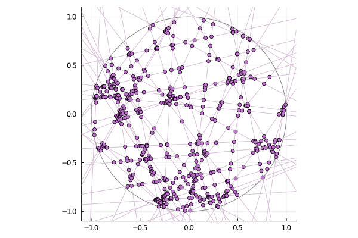

# LineIntersections


This package contains resources for the generation of 2-dimensional random line processes, as well as their intersection points. In particular, there is a tailored version of the Bentley-Ottman algorithm.  



This is a poisson line intersection process. 


## Line objects

A two-dimensional line is uniquely parametrized by the coordinates of the projection of the origin on the line, that is, by two numbers (theta, r) where theta is an angle and r a nonnegative number. This is the content of the `Line` type.


Below is a poisson line process, shifted along the x-axis, and the corresponding transformation undergone by its `Line` representation. 


*Example*

```julia
radius = 1 ; number_of_lines = 50
H = hyperplanes_poisson(radius, number_of_lines)
intersection_points = find_all_intersections(H)
```

## Intersections

The function find_all_intersections takes as input an array of lines and an optional radius R = 1 ; the output is a dictionary with keys the couples of intersecting lines, and values the intersection points between these lines. 


## Todo : 
- Vertical lines
- Multiple intersections
- Implement other line processes


