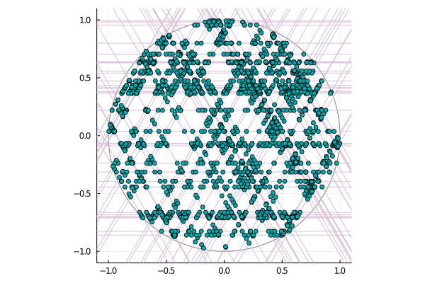

# LineIntersections


This package contains resources for the generation of 2-dimensional random line processes, as well as their intersection points. 



Left is a poisson line intersection process, ie the intersection points of a Poisson hyperplane process in two dimensions. Right is an anisotropic version: instead of being uniform, the angles are randomly chosen in -pi/2, pi/3 and 2pi/3.


## Line objects

A two-dimensional line is uniquely parametrized by the coordinates of the projection of the origin on the line, that is, by two numbers (theta, r) where theta is an angle and r a nonnegative number. This is the content of the `Line` type; for instance, the horizontal line passing with y-cordinate 3 is simply

```Julia
l = Line(pi/2, 3).
```

This representation will be called the *strip representation*.

There is a (small) number of random line generators; for instance, for [Poisson Line Processes](https://hpaulkeeler.com/simulating-a-poisson-line-process/), the function `hyperplanes_poisson` returns an `Array{Line}` filled with lines whose strip representation form a poisson *point* process. In the figure below is a poisson line process, shifted along the x-axis, and the corresponding transformation undergone by its `Line` representation. 


## Intersections

Currently there are two functions for finding the intersection points of a set of lines: `intersections_naive` and `find_all_intersections`. The first one loops over the n(n-1)/2 pairs of distinct lines and thus yields a naive O(n^2) algorithm. The other one is the classical [Bentley-Ottman algorithm](https://en.wikipedia.org/wiki/Bentley%E2%80%93Ottmann_algorithm), which finds all the k intersection points in O((n+k)log(n)). 

The use of the BO algorithm will be preferred when k is notably smaller than n^2/log(n); note that for many point processes, the number of intersection points in a disk scales like n^2, where n is the number of lines intersecting the disk... This is the case for Poisson lines, for instance, hence the naive algorithm should be preferred. 


*Example*

```julia
radius = 1 ; intensity = 3
H = hyperplanes_poisson(radius, intensity)
intersection_points = intersections_naive(H)
```


## Todo : 
- Vertical lines
- Multiple intersections points.
- Implement other line processes.
- Implement Bentley-Ottman for general segments, not only for lines. 


